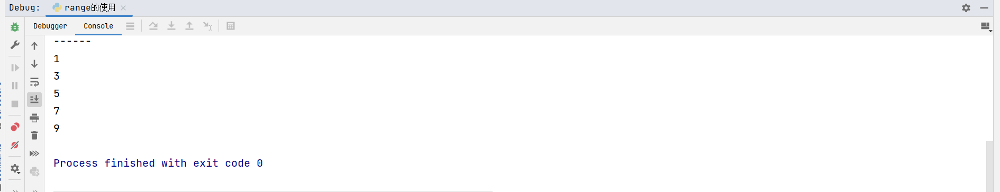

# Python安装

打开官网https://www.python.org，根据下图进行安装（Mac版）


点击Downloads进入


windows用户注意


mac用户同理选择合适的安装器下载。


下载完毕后开始安装，安装过程中一路下一步即可。

安装完毕后检查是否成功。

打开终端

```shell
➜  ~ python3
Python 3.10.8 (v3.10.8:aaaf517424, Oct 11 2022, 10:14:40) [Clang 13.0.0 (clang-1300.0.29.30)] on darwin
Type "help", "copyright", "credits" or "license" for more information.
>>> 
```

没问题。

# 开发工具

开发工具我推荐使用Jetbrains的PyCharm。下载地址https://www.jetbrains.com/pycharm/


安装过程就省略了。

# 创建项目

打开PyCharm，按照图片上说明设置项目信息，并创建项目。


**创建一个python文件**

鼠标放到项目名称上，邮件选择New，再选择Python File。输入文件名即可创建一个文件。

# 工具编码设置

设置PyCharm的编码，保证文件的编码都是UTF-8，会避免很多问题。


# 开始

首先来以为项目入口函数开始，每种语言都会介绍的hello world，对python有个基本的认识。

```python
if __name__ == '__main__':
    print("hello world")
```

额，学过java和go，python这是啥语法。。。

看过介绍才了解到python的语法其实还是很简单的。if是个关键字，条件判断，___name__是个变量，==是比较运算符，'__main__'是字符串，print是函数的名字，'hello world'是一个字符串，也是print函数的参数。

有了初步的了解后，加下来具体学习下。

# 字面量

在计算机科学中，字面量（literal）是用于表达源代码中一个固定值的表示法（notation）。

```python
1  # 1是一个字面量
2.3  # 2.4是一个字面量
"字符串字面量"  # 该字符串是一个字面量
a = 1  # 1是一个字面量
```

# 注释

每种语言都有注释，知识方式不同，注释的用途是说明变量、方法函数的作用。他不会被执行。只是说明性问题。开发中要求开发人员写好注释，这对于代码的可读性有很大提升，别人能通过你的注释知道你写的代码是什么意思。

python中的注释有两种，一种单行注释，以#开头，一种是多行注释以三引号的形式"""这里是注释的内容"""，

规范：一般来说单行注释用于注释变量等，多行注释注释方法，文件说明，包的说明等等。

#后面跟一个空格

规范并不是强制要求。

来尝试下。

```python
# name代表学生姓名
name = 1

"""age代表学生年龄"""
age = 1
```

上面的单行注释使用在了变量上，并不建议。

# 变量

上面有提到变量，但是变量是什么呢？变量是程序中的一种标识符（变量的名字、类的名字等等），用于存储值的。

```python
# name就是一个变量
name = "刘备"
print(name)  # 刘备
# 因为是变量，所以可以变化，重新赋值
name = "张飞"
print(name)  # 张飞
```

print用于打印，结果会在控制台输出，点击空白处，选择Run或者Debug运行代码。


上面的=是赋值运算符，后面会介绍。

# 标识符

什么是标识符，python中的变量名字，类名字等统称标识符。

标识符有样要求，比如只能是字母、数字、下划线，但是不能以为字母开头。

规范：不推荐驼峰（比如studentName）,推荐使用下划线分割student_name

```python
# 3a = 1 # 这是不允许的，不能以数字开头
a = 1  # 正确
a_b = 2  # 正确
studentName = "诸葛亮"  # 这是允许的，但是不符合python规范，python不推荐驼峰命名法，而是推荐使用下划线分割，student_name是推荐的。
```

# 数据类型

python中支持的数据类型主要有以下几种：

* Number（数字）
* Bool（布尔类型）

* String（字符串）
* List（列表）
* Tuple（元组）
* Set（集合）
* Dictionary（字典）


## Number（数字）

主要分为三种：

整型（int）：比如0， 1， -1， -100等

浮点型（float）：比如1.2，-2.3，分为整数部分和小数部分

复数（complex）：分为实部和虚部, a + bj，虚部必须使用j或者J。

布尔（bool）：布尔类型，只有两个取值True和False，也就是是和否的概念。

```python
# 整数类型
i = 1
print(i)  # 1
# 如果数字比较长，可以使用_分割
j = 100_24
print(j)  # 10024

# 浮点型
a = 1.1
print(a)
b = -1.2
print(b)

# 复数,复数的格式是 a + bj(J)
c1 = 1 + 3j
print("c1的类型是", type(c1), "值是", c1)  # c1的类型是 <class 'complex'> 值是 (1+3j)
# 数字类型中还有一个布尔类型
# --------布尔类型--------
b1 = True
b2 = False
```


## String（字符串）

python中所有以单引号或者双引号或者三引号抱起来的内容，都是字符串。

```python
# -------------字符串-------------
s = "a"  # 使用双引号括起来的是字符串
print(s)
s1 = '学习python' # 也可以使用单引号
print(s1)
s2 = """
我
在
学习
python
"""  # 可以使用三引号，三引号是允许换行的，并且保留格式
print(s2)
```


## List（集合）

List是集合类型，使用[]来定义数据，请看如下代码

```python

# -------------List类型-------------
l1 = [1, 2]
print("l1的类型是", type(l1), "值是", l1)  # l1的类型是 <class 'list'> 值是 [1, 2]
# 可以存储任意类型
l2 = [1, "曹操", 1.2, 1 + 2j]
print("l2的类型是", type(l2), "值是", l2)  # l2的类型是 <class 'list'> 值是 [1, '曹操', 1.2, (1+2j)]

# 通过下标修改，下标index从0开始
l2[0] = 10
print("l2的类型是", type(l2), "值是", l2)  # l2的类型是 <class 'list'> 值是 [10, '曹操', 1.2, (1+2j)]
# 以下修改会出错，因为l2下标目前对打是3，没有4，所有提示找不到。IndexError: list assignment index out of range
# l2[4] = -1
# print("l2的类型是", type(l2), "值是", l2)
# 增加元素
l2.append("刘备")
print(l2)  # [10, '曹操', 1.2, (1+2j), '刘备']
# 删除元素
del l2[len(l2) - 1]
print(l2)  # [10, '曹操', 1.2, (1+2j)]
```

这里简单介绍下，List内容较多。之后慢慢学习。

## Tuple（元组）

## Set（集合）

## Dictionary（字典）

# 数据类型转换

数据类型转化主要介绍数字类型、布尔类型、以及字符串类型的转换，转换规则看代码以及注释中的详细说明

```python

# ------数据类型转换,转换为那种类型就用那种类型对应的函数，很方便记忆，比如转换为string，就使用str(),str是string的简写,转换为int就使用int()---------
# 整数、浮点数、布尔类型转换为字符串
s1 = str(1)  # 整数
print("s1的类型是", type(s1), "值是", s1)  # s1的类型是 <class 'str'> 值是 1
s2 = str("123.44")  # 浮点数
print("s2的类型是", type(s2), "值是", s2)  # s2的类型是 <class 'str'> 值是 123.44
s3 = str(True)  # 布尔
print("s3的类型是", type(s3), "值是", s3)  # s3的类型是 <class 'str'> 值是 True

# 字符串、浮点型、布尔类型等转化为整数，使用int()方法
i1 = int("11")
print("i1的类型是", type(i1), "值是", i1)  # i1的类型是 <class 'int'> 值是 11
# 不是所有的字符都能转化为整数，必须是数字字符串才可以
# i2 = int("中国")  # 转化不会成功，会提示错误ValueError: invalid literal for int() with base 10: '中国'，中国不是数字类型的字符串是没办法转化为数字的
# print("i2的类型是", type(i2), "值是", i2)
# 布尔类型转化为整数，True会被转化为1，False会被转化为0。
i2 = int(True)
print("i2的类型是", type(i2), "值是", i2)  # i2的类型是 <class 'int'> 值是 1
i3 = int(False)
print("i3的类型是", type(i3), "值是", i3)  # i3的类型是 <class 'int'> 值是 0
# 浮点数转化为整数,小数部分会被舍弃
i3 = int(1.2345)
print("i3的类型是", type(i3), "值是", i3)  # i3的类型是 <class 'int'> 值是 1
# 复数是不能转化为int的
# i3 = int(1 + 2j)  # 此处会执行错误，TypeError: int() argument must be a string, a bytes-like object or a real number, not
# 'complex'


# 字符串、整数转换为浮点数，非数字或者非浮点数样子的字符串是不能够转化为浮点数的。
f = float(12)
print("f的类型是", type(f), "值是", f)  # f的类型是 <class 'float'> 值是 12.0
f = float("235.33")
print("f的类型是", type(f), "值是", f)  # f的类型是 <class 'float'> 值是 235.33
```

# 运算符

## 算数运算符

以下假设变量 a 为 21，变量 b 为 10：

| 运算符 | 描述                                            | 实例                                    |
| :----- | :---------------------------------------------- | :-------------------------------------- |
| +      | 加 - 两个对象相加                               | a + b 输出结果 31                       |
| -      | 减 - 得到负数或是一个数减去另一个数             | a - b 输出结果 11                       |
| *      | 乘 - 两个数相乘或是返回一个被重复若干次的字符串 | a * b 输出结果 210                      |
| /      | 除 - x 除以 y                                   | a / b 输出结果 2.1                      |
| %      | 取模 - 返回除法的余数                           | a % b 输出结果 1                        |
| **     | 幂 - 返回 x 的 y 次幂                           | a ** b 为 21 的 10 次方                 |
| //     | 取整除 - 返回商的整数部分                       | 9//2 输出结果 4 , 9.0//2.0 输出结果 4.0 |

```python
i = 1
j = 2
# +运算符
print(i + j)  # 3
# -运算符
print(i - j)  # -1
# *运算符
print(i * j)  # 2
# / 运算符
print(i / j)  # 0.5
# print(i / 0)  # 会报错，除数不能说0

# // 运算符
print(i // j)  # 0而不是0.5 小数部分会被舍弃

# %求余数
print(i % j)  # 1

# ** 幂运算符
# 打印2的三次幂，结果是8
print(2 ** 3)  # 8
```

## 比较运算符

以下假设变量 a 为 10，变量 b 为 20：

| 运算符 | 描述                                | 实例                  |
| :----- | :---------------------------------- | :-------------------- |
| ==     | 等于 -- 比较对象是否相等            | (a == b) 返回 False。 |
| !=     | 不等于 -- 比较两个对象是否不相等    | (a != b) 返回 True.   |
| >      | 大于 -- 返回 x 是否大于 y           | (a > b) 返回 False。  |
| <      | 小于 -- 返回 x 是否小于 y。         | (a < b) 返回 True。   |
| >=     | 大于等于 -- 返回 x 是否大于等于 y。 | (a >= b) 返回 False。 |
| <=     | 小于等于 -- 返回 x 是否小于等于 y。 | (a <= b) 返回 True。  |

## 赋值运算符

以下假设变量 a 为 10，变量 b 为 20：

| 运算符 | 描述             | 实例                                  |
| :----- | :--------------- | :------------------------------------ |
| =      | 简单的赋值运算符 | c = a + b 将 a + b 的运算结果赋值为 c |
| +=     | 加法赋值运算符   | c += a 等效于 c = c + a               |
| -=     | 减法赋值运算符   | c -= a 等效于 c = c - a               |
| *=     | 乘法赋值运算符   | c *= a 等效于 c = c * a               |
| /=     | 除法赋值运算符   | c /= a 等效于 c = c / a               |
| %=     | 取模赋值运算符   | c %= a 等效于 c = c % a               |
| **=    | 幂赋值运算符     | c **= a 等效于 c = c ** a             |
| //=    | 取整除赋值运算符 | c //= a 等效于 c = c // a             |

## 位运算符

按位运算符是把数字看作二进制来进行计算的。Python 中的按位运算法则如下：

下表中变量 a 为 60，b 为 13。

|                     | 按位与运算（a&b） | 按位或运算(a\|b) | 按位异或（a^b） |
| :-----------------: | :---------------: | :--------------: | :-------------: |
| a（60）的二进制表示 |     0011 1100     |    0011 1100     |    0011 1100    |
| b（13）的二进制表示 |     0000 1101     |    0000 1101     |    0000 1101    |
|      运算结果       |     0000 1100     |    0011 1101     |    0011 0001    |
|  结果的十进制表示   |        12         |        61        |       49        |

|                      | 按位取反（~a） | 左移（a<<2） | 右移(a>>2) |
| :------------------: | :------------: | :----------: | :--------: |
| a（60）的二进制表示  |   0011 1100    |  0011 1100   | 0011 1100  |
|       运算结果       |   1100 0011    |  1111 0000   | 0000 1111  |
| 运算结果的十进制表示 |      -61       |     240      |     15     |

| 运算符 | 描述                                                         | 实例                                          |
| :----- | :----------------------------------------------------------- | :-------------------------------------------- |
| &      | 按位与运算符：参与运算的两个值,如果两个相应位都为 1,则该位的结果为 1,否则为 0 | (a & b) 输出结果 12 ，二进制解释： 0000 1100  |
| \|     | 按位或运算符：只要对应的二个二进位有一个为 1 时，结果位就为 1。 | (a \| b) 输出结果 61 ，二进制解释： 0011 1101 |
| ^      | 按位异或运算符：当两对应的二进位相异（不同）时，结果为 1     | (a ^ b) 输出结果 49 ，二进制解释： 0011 0001  |
| ~      | 按位取反运算符：对数据的每个二进制位取反,即把 1 变为 0，把 0 变为 1 | (~a ) 输出结果 -61 ，二进制解释： 1100 0011   |
| <<     | 左移动运算符：运算数的各二进位全部左移若干位，由"<<"右边的数指定移动的位数，高位丢弃，低位补 0。 | a << 2 输出结果 240 ，二进制解释： 1111 0000  |
| >>     | 右移动运算符：把">>"左边的运算数的各二进位全部右移若干位，">>"右边的数指定移动的位数 | a >> 2 输出结果 15 ，二进制解释： 0000 1111   |

## 逻辑运算符

以下假设变量 a 为 10, b 为 20:

| 运算符 | 逻辑表达式 | 描述                                                         | 实例                    |
| :----- | :--------- | :----------------------------------------------------------- | :---------------------- |
| and    | x and y    | 布尔"与" - 如果 x 为 False，x and y 返回 False，否则它返回 y 的计算值。 | (a and b) 返回 20。     |
| or     | x or y     | 布尔"或" - 如果 x 是 True，它返回 x的值，否则它返回 y 的计算值。 | (a or b) 返回 10。      |
| not    | not x      | 布尔"非" - 如果 x 为 True，返回 False 。如果 x 为 False，它返回 True。 | not(a and b) 返回 False |

python的逻辑运算符跟其他的语言有些差别，java或者go等语言会使用&& 或者 ||以及!

```python
j = False
if not j:
    print("j不等于True")

# and
i = False
if j and i:
    print("j和i都是true")  # 此处不会打印，因为j和i等于False，其实如果其中有一个等于False都不会打印

# or
k = True
if j or k:
    print("j或者k有一个是True，就会打印该语句")  # j或者k有一个是True，就会打印该语句
```

## 运算符优先级

## Python 运算符优先级

以下表格列出了从最高到最低优先级的所有运算符：

| 运算符                                                       | 描述                               |
| :----------------------------------------------------------- | :--------------------------------- |
| `(expressions...)`,`[expressions...]`, `{key: value...}`, `{expressions...}` | 圆括号的表达式                     |
| `x[index]`, `x[index:index]`, `x(arguments...)`, `x.attribute` | 读取，切片，调用，属性引用         |
| await x                                                      | await 表达式                       |
| `**`                                                         | 乘方(指数)                         |
| `+x`, `-x`, `~x`                                             | 正，负，按位非 NOT                 |
| `*`, `@`, `/`, `//`, `%`                                     | 乘，矩阵乘，除，整除，取余         |
| `+`, `-`                                                     | 加和减                             |
| `<<`, `>>`                                                   | 移位                               |
| `&`                                                          | 按位与 AND                         |
| `^`                                                          | 按位异或 XOR                       |
| `|`                                                          | 按位或 OR                          |
| `in,not in, is,is not, <, <=, >, >=, !=, ==`                 | 比较运算，包括成员检测和标识号检测 |
| `not x`                                                      | 逻辑非 NOT                         |
| `and`                                                        | 逻辑与 AND                         |
| `or`                                                         | 逻辑或 OR                          |
| `if -- else`                                                 | 条件表达式                         |
| `lambda`                                                     | lambda 表达式                      |
| `:=`                                                         | 赋值表达式                         |

# 字符串扩展

## 字符串的定义方式

字符串可以通过单号，双引号，三引号括起来，前面学习的时候已经使用过。这里说下一种特殊情况，就是特殊字符处理，比如我的内容里有单双三引号怎么办。

* 如果你的字符串里只有单引号那么可以使用双引号或者三引号包裹起来就不会有问题。

* 如果你的字符串里只有双引号，可以使用单引号包裹起来
* 如果字符串里又有单引号字符，又有双引号字符，那么就需要转义字符\反斜杠来将字符转义，转义字符能适合各种场景

```python
# 字符串里包含单引号，那么可以使用双引号或者三引号包起来
s = "我正在学习'python'"
print(s)  # 这是没有问题的能够正常编译输出,输出我正在学习'python'
# 但是如果使用单引号定义我正在学习'python'就会出现问题。
# s = '我正在学习'python''  # 编译是不通过的

# 如果字符串里有只包含双引号
# s = "我正在学习'"pytho""  # 那么使用双引号是不可以的，可以使用单引号包裹
s = '我正在学习"python"'
print(s)  # 我正在学习"python"

# 如果字符串里同时有单双引号，那么使用单引号或者双引号都无法解决，需要使用\来转义字符
s = "我\"正在学习\"，'python'"

```

## 字符串拼接

字符串拼接一般使用+运算符来拼接。

```python
# 直接使用+来拼接
print("我正在学习" + "python")
# 如果有变量也直接拼接变量即可
greet = "大家好"
print(greet + "我正在学习" + "python")
# 字符串拼接其他类型，比如int
age = 20
# print(greet + "," + age + "的" + "我正在学习" + "python")  # age是int类型，直接拼接会报错，需要转化,使用str(int)函数
print(greet + "," + str(age) + "的" + "我正在学习" + "python")
```

## 字符串格式化

但是使用str方法虽然解决，但是觉得麻烦不，可以%占位，然后用值来替换。

```python
# %拼接字符串，前面是字符串，通过%s,%d(数字),%f(浮点数)来占位，之后使用%连接参数，多个参数用扩招括起来
print("%s,%s的我正在学习python" % (greet, age))  # 大家好,20的我正在学习python，这里我age我使用%s也没有问题，会自动转化
```

## 数字精度控制

数字精度控制通过m.n的形式来控制，m控制数字的宽度（小数点前面数字的长度），n控制精度（小数点后面的长度）比如1，我想输出位1.0就可以写成%.1d

```python
# 精度
num = 112.345
print("num = 20宽度是5，格式化结果是：%5d" % num)  # num = 20宽度是5，格式化结果是：  112，注意最后112的前面是有2个空格的
print("num = 20宽度是5，精度是3，格式化结果是：%5.2f" % num)  # num = 20宽度是5，精度是2，格式化结果是：112.34
```

## 快速格式化方式

字符串前增加f表示，字符串中使用{变量}的方式来快速格式化字符串，该方式在实际开发中比较常用。

```python
# 快速格式化
print(f"{greet}, {age}的我正在学习python")
```

# 控制台输入

就是允许接收用户输入的参数，比如银行中用户输入密码，计算机读取到密码，进行匹配。

```python
# 输入name，和age，打印输出我是name，我今年age岁
name = input("姓名：")
age = input("年龄：")
print(f"我是{name}，我今年{age}岁")
```

输入姓名后回车，在输入姓名回车。就会打印出来，最后的一句话。

# IF语句

python中if语句后接表达式（返回bool类型），然后使用：作为结束标志，注意缩进，python不像其他语言使用大括号作为条件或者函数体，而是使用：，然后通过首行缩进（四个空格）来标记。

可以搭配elif和else使用。

```python
i = 0
if i >= 0:
    print("i >= 0")  # print("i >= 0") i >= 0
print("这里不是if的条件执行体")
# 多条件可以送elif，其他情况可以使用else
if i > 0:
    print("i >=0")
elif i < 0:
    print("i < 0")
else:
    print("i == 0")
```

IF等语句也可以嵌套使用注意缩进即可。

# While语句

while是当什么什么的意思，后面使用表达式，只有表达式是True的时候，才会执行表达式执行体

```python
i = 0
while i >= 0:
    print("i >= 0")
```

上面的就是一个while表达式的使用示例，但是他是一个死循环。

```python
i = 0
while 0 <= i < 10:
    print("i >= 0")
```

当i==10的时候就不会继续执行了，也可以使用break停止循环。

# For循环

for用于循环输出序列

```python
s = "我是中国人"
for c in s:
    print(c)
```

# Range

顾名思义，range是范围的意思，用它可以快速创建序列，比如range(5)，结果就是[0, 1, 2, 3, 4]

```python
l = range(5)
print(f"list的类型是{type(l)}")
for i in l:
    print(i)  #结果是0，1，2，3，4
```

也可以指定前后临界值

```python
l = range(2, 5)
for i in l:
    print(i)  # 结果是[2, 3, 4]
```

也可以指定步长

```python
# 设置步长
l = range(1, 10, 2)  # 左开右闭区间[1, 10)内，按照步长等于2取值，结果是[1, 3, 5, 7, 9]
for i in l:
    print(i)
```


